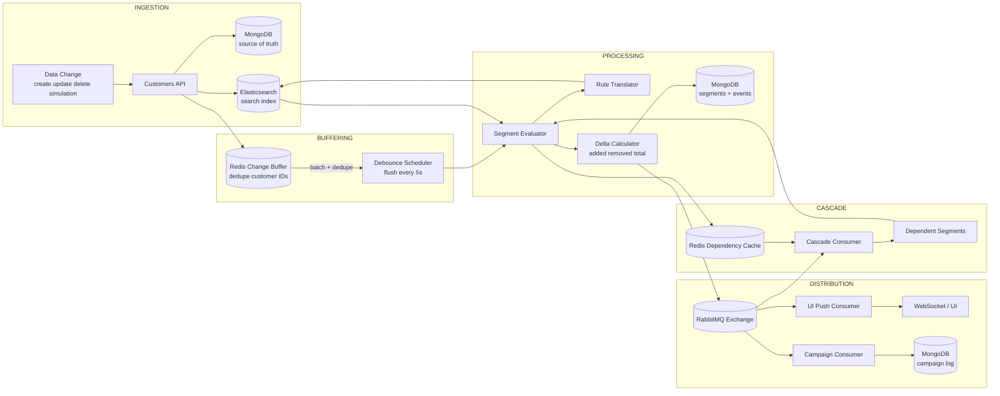
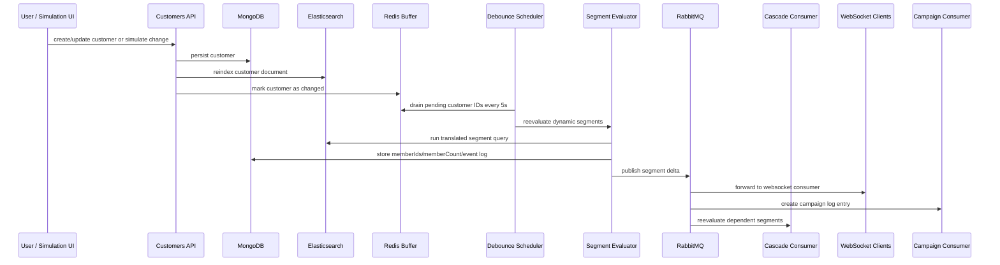
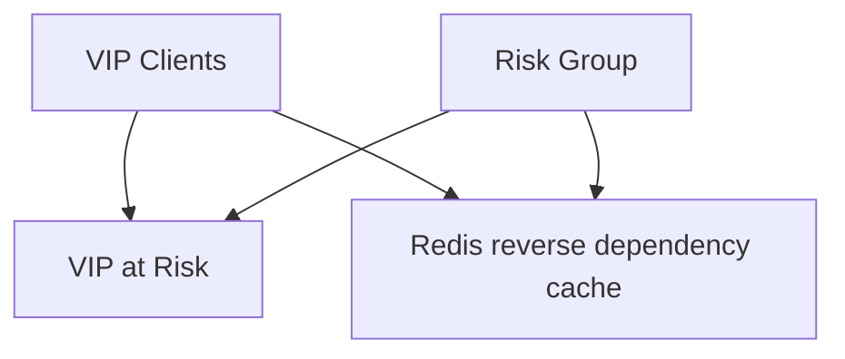

# Drift Happens

Drift Happens is a customer segmentation console for exploring how segment membership changes when customer data drifts over time. It combines a Nuxt frontend, a NestJS backend, MongoDB as the source of truth, Elasticsearch for rule evaluation, Redis for buffering and dependency lookups, and RabbitMQ for event fan-out.

## What This Task Is About

Drift Happens is a small but realistic segmentation platform that can define static and dynamic customer segments, evaluate segment rules against customer data, track who entered or left a segment, simulate data drift such as new purchases or inactivity and show every change in frontend in real time.

The interesting part of this task was not only computing a segment once, but handling the operational side of the "segment drift", buffering frequent customer updates, reevaluating changed segments, cascading changes across dependent segments, and visualizing the results in the UI.

## Repository Layout

```text
.
|-- compose.yaml
|-- drift-happens-backend/   # NestJS API, evaluators, consumers, seed script
`-- drift-happens-frontend/  # Nuxt UI for segments, simulation, campaigns
```

## Getting Started

### Prerequisites

- Docker Desktop with Compose support
- Node.js 22.x
- npm 10+

### Fastest Way To Launch

This is the most practical way to see the system working end to end.

1. Start the full stack:

```powershell
docker compose up --build
```

2. In a second terminal, install backend dependencies if needed:

```powershell
Set-Location .\drift-happens-backend
npm install
```

3. Seed the databases from your local machine.
   The production backend container does not include `ts-node` or the seed source files, so seeding is meant to be run from the repo workspace:

```powershell
npm run seed
```

4. Open the apps:

- Frontend: `http://localhost:3000`
- Backend API: `http://localhost:8080`
- RabbitMQ management: `http://localhost:15672`

### Local Development Mode

If you want live reload for the apps instead of running both app containers:

1. Start only infrastructure:

```powershell
docker compose up mongodb redis rabbitmq elasticsearch -d
```

2. Start the backend:

```powershell
Set-Location .\drift-happens-backend
npm install

npm run start:dev
```

3. Seed the data:

```powershell
npm run seed
```

4. Start the frontend in another terminal:

```powershell
Set-Location .\drift-happens-frontend
npm install

npm run dev
```

### Seed Data

The seed script creates 200 customers and then creates five default segments:

- `Active Buyers`: customers with a transaction in the last 30 days
- `VIP Clients`: customers with `totalSpent >= 5000`
- `Risk Group`: customers inactive for more than 90 days but with prior spend
- `VIP at Risk`: intersection of `VIP Clients` and `Risk Group`
- `March Campaign`: a static snapshot based on recent account creation

The customer seed mix is intentionally shaped so the segment interactions are easy to inspect:

- 50 active buyers
- 40 active VIP customers
- 30 VIP customers who have become inactive
- 40 non-VIP at-risk customers
- 40 newly created customers with no transactions

### Useful Pages

- `/segments`: all segments with live member counts
- `/segments/:id`: segment detail, rule tree, members, delta history
- `/simulation`: trigger transactions, inactivity, field changes, bulk imports
- `/campaigns`: campaign log generated from segment delta events

## Architecture

### Component Communication and Signal Flow



Why this shape:

- MongoDB is the source of truth for customers, segments, audit events, and campaign log entries.
- Elasticsearch is used as the evaluation engine so segment rules can be translated into search queries instead of being executed as ad hoc Mongo filters.
- Redis is used for two short-lived coordination jobs: buffering changed customer IDs and caching reverse segment dependencies.
- RabbitMQ decouples segment reevaluation from downstream reactions such as UI notifications, cascade processing, and campaign processing.

### Segment Drift Processing



Why this approach:

- It absorbs bursts of customer changes instead of reevaluating every dynamic segment on every single write.
- It preserves an exact delta of `added` and `removed` members for auditability and downstream actions.
- It keeps the UI reactive without coupling browser updates directly to write requests.

Trade-offs:

- The system is eventually consistent rather than instantly consistent because dynamic segments are flushed on a schedule.
- The infrastructure footprint is larger than a single-database solution.
- Dual persistence between MongoDB and Elasticsearch means indexing lag must be handled carefully.

### Segment Dependency Model



Why this matters:

- `IN_SEGMENT` rules allow one segment to depend on another.
- Dependencies are rebuilt and cached so the system can quickly ask, "if segment A changed, which segments must be reevaluated next?"
- Cascades are bounded with visited IDs and a max depth to reduce loop risk.

### Main Architectural Decisions

#### 1. MongoDB + Elasticsearch instead of MongoDB alone

- the rule language maps naturally to Elasticsearch query DSL
- large membership searches are cleaner to express in search queries
- exact member id lists can be retrieved and diffed efficiently

#### 2. Asynchronous fan-out through RabbitMQ instead of direct service calls

- one segment delta needs to feed multiple consumers with different responsibilities
- campaign processing, UI notifications, and cascades should not block the write path
- retry boundaries are clearer

#### 3. Redis buffering instead of reevaluating immediately on every customer change

- customer updates can arrive in bursts
- multiple writes to the same customer within a short window should collapse into one reevaluation wave
- Redis sets are a simple fit for deduplicating changed customer id

#### 4. Static and dynamic segments both persisted in MongoDB

- the UI and APIs can treat segments uniformly,
- static segments still benefit from rules as reproducible definitions,

#### 5. Nuxt 3 as a frontend framework

- Nuxt supports SSR(Server Side Rendering) that helps improve loading speeds and SEO 
- The segment dashboard needs SSR for the initial page load
- I am more familiar with Nuxt framework in frontend so building and debugging was less time consuming

## API and Feature Summary

Backend endpoints:

- `GET /segments`, `POST /segments`, `PATCH /segments/:id`
- `GET /segments/:id/members`
- `GET /segments/:id/events`
- `POST /segments/:id/refresh`
- `GET /customers`, `POST /customers`, `PATCH /customers/:id`, `DELETE /customers/:id`
- `POST /simulate/transaction`
- `POST /simulate/timeout`
- `POST /simulate/field-update`
- `POST /simulate/bulk-import`
- `GET /campaigns/log`

Frontend:

- live segment overview,
- per-segment member and delta inspection,
- drift simulation panel,
- real-time campaign activity stream.


